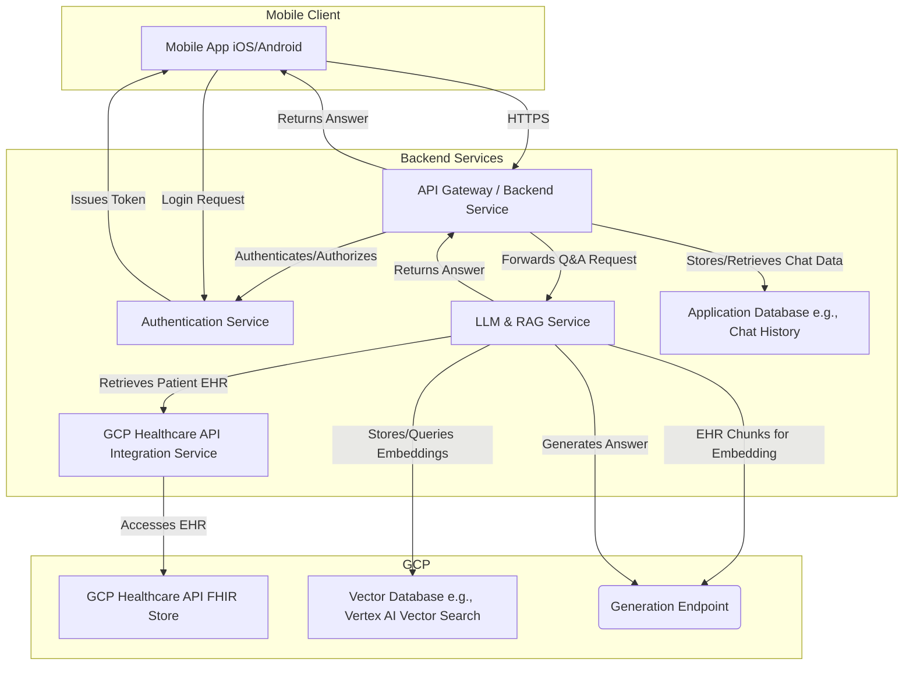

# System Design: Physician Q&A Mobile Chat Application

## 1. Overview

This document outlines the system design for a mobile chat application enabling physicians to perform question-answering (Q&A) about specific patients. The application leverages Large Language Models (LLMs) and Retrieval Augmented Generation (RAG) based on Electronic Health Records (EHR) stored in Google Cloud Platform (GCP) Healthcare API. The application will be available on both iOS and Android platforms.

## 2. Goals

*   Provide a secure and intuitive mobile interface for physicians.
*   Enable physicians to select a patient and ask questions related to their EHR.
*   Utilize LLM and RAG to generate accurate and contextually relevant answers based solely on the selected patient's EHR.
*   Ensure HIPAA compliance and robust data security for sensitive patient information.
*   Maintain a history of conversations for each patient.
*   Authenticate and authorize physicians securely.

## 3. Non-Goals

*   Real-time patient monitoring.
*   Direct modification of EHR data through the chat interface.
*   Diagnostic capabilities or treatment recommendations (the system provides information, not medical advice).
*   Support for communication between multiple physicians or with patients.
*   Integration with EHR systems beyond GCP Healthcare API for EHR retrieval.

## 4. Key Components

### 4.1. Mobile Application (iOS & Android)
    *   **Framework**: React Native / Flutter (for cross-platform development) or Native (Swift/Kotlin).
    *   **Responsibilities**:
        *   User authentication (login/logout).
        *   Patient selection interface.
        *   Chat interface for Q&A.
        *   Displaying responses from the backend.
        *   Securely storing session tokens.
        *   Local caching of non-sensitive data for performance.

### 4.2. Backend Service
    *   **Technology**: Node.js (Express.js) / Python (Flask/Django) / Go.
    *   **Responsibilities**:
        *   API gateway for mobile app requests.
        *   User session management.
        *   Orchestrating communication between different services (Auth, GCP Healthcare API, LLM/RAG Service).
        *   Managing chat history.
        *   Enforcing business logic and authorization rules.

### 4.3. Authentication Service
    *   **Technology**: OAuth 2.0 / OpenID Connect provider (e.g., Firebase Authentication, Auth0, Keycloak, or custom implementation integrated with hospital identity provider).
    *   **Responsibilities**:
        *   Verifying physician credentials.
        *   Issuing and validating access tokens.
        *   Managing user identities and roles.

### 4.4. GCP Healthcare API Integration Service
    *   **Responsibilities**:
        *   Securely authenticating with GCP Healthcare API.
        *   Fetching patient lists for authorized physicians.
        *   Retrieving specific patient EHR data (e.g., FHIR resources) based on requests.
        *   Ensuring data access complies with GCP IAM policies and patient consent.

### 4.5. LLM & RAG Service
    *   **Components**:
        *   **Vector Database**: Stores embeddings of EHR documents (e.g., Pinecone, Weaviate, Vertex AI Vector Search).
        *   **Embedding Model**: Converts text chunks from EHR into vector embeddings.
        *   **LLM**: Generates answers based on retrieved context (e.g., Vertex AI PaLM API, OpenAI GPT models deployed securely).
        *   **RAG Orchestrator**:
            1.  Receives a physician's question and patient ID.
            2.  Retrieves relevant EHR documents/chunks for the patient from the GCP Healthcare API Integration Service.
            3.  (Optional but recommended) Pre-processes and chunks EHR data.
            4.  Generates embeddings for the question and EHR chunks (or retrieves pre-computed embeddings for EHR).
            5.  Queries the vector database to find the most relevant EHR excerpts for the question.
            6.  Constructs a prompt for the LLM, including the question and the retrieved context.
            7.  Sends the prompt to the LLM and receives the generated answer.
            8.  (Optional) Post-processes the answer for clarity and safety.
    *   **Responsibilities**:
        *   Processing natural language questions.
        *   Retrieving relevant information from patient EHRs.
        *   Generating coherent and accurate answers.
        *   Ensuring answers are based *solely* on the provided patient's EHR context.

### 4.6. Database
    *   **Technology**: PostgreSQL / MySQL / Firestore (NoSQL).
    *   **Responsibilities**:
        *   Storing physician user profiles (non-sensitive metadata, preferences).
        *   Storing chat history (questions, answers, timestamps, patient ID association).
        *   Storing references or metadata for EHR documents if needed for RAG indexing (actual PHI should remain in GCP Healthcare API or be handled with extreme care if temporarily processed).

## 5. Architecture Diagram

## 6. Data Flow (Patient Q&A)

1.  **Physician Login**:
    *   Physician opens the mobile app and enters credentials.
    *   App sends credentials to the Authentication Service.
    *   Authentication Service verifies credentials and returns an access token.
    *   App stores the token securely.

2.  **Patient Selection**:
    *   Physician requests a list of their patients.
    *   App sends a request (with token) to the Backend Service.
    *   Backend Service verifies token, then requests patient list from GCP Healthcare API Integration Service.
    *   GCP Healthcare API Integration Service fetches the list from GCP Healthcare API (respecting physician's access rights).
    *   List is returned to the app. Physician selects a patient.

3.  **Question Submission**:
    *   Physician types a question about the selected patient and submits it.
    *   App sends the question, patient ID, and access token to the Backend Service.

4.  **Backend Processing & RAG**:
    *   Backend Service validates the token and request.
    *   Backend Service forwards the question and patient ID to the LLM & RAG Service.
    *   **LLM & RAG Service**:
        *   a. **EHR Retrieval**: Contacts GCP Healthcare API Integration Service to fetch relevant EHR documents/data for the specified patient.
        *   b. **Chunking & Embedding (if not pre-indexed)**: EHR data is chunked. Chunks are converted to vector embeddings using an embedding model. These embeddings can be stored in the Vector Database for future queries related to this patient's data if a pre-indexing strategy is adopted. For on-the-fly RAG, embeddings are generated per query.
        *   c. **Query Embedding**: The physician's question is converted into a vector embedding.
        *   d. **Similarity Search**: The question embedding is used to query the Vector Database (or the freshly embedded EHR chunks) to find the most semantically similar EHR excerpts (context).
        *   e. **Prompt Construction**: A prompt is created containing the original question and the retrieved context.
        *   f. **LLM Invocation**: The prompt is sent to the LLM.
        *   g. **Answer Generation**: The LLM generates an answer based *only* on the provided context.
        *   h. **Post-processing (Optional)**: The answer might be checked for safety, factual grounding against the source, or hallucinations.

5.  **Response Delivery**:
    *   The LLM & RAG Service returns the generated answer to the Backend Service.
    *   Backend Service logs the question and answer in the Application Database (chat history).
    *   Backend Service sends the answer back to the mobile app.
    *   Mobile app displays the answer to the physician.

## 7. API Design (High-Level)

### 7.1. Authentication
*   `POST /auth/login` - Physician login.
*   `POST /auth/refresh` - Refresh access token.
*   `POST /auth/logout` - Physician logout.

### 7.2. Patients
*   `GET /patients` - List patients accessible to the physician.
*   `GET /patients/{patientId}` - Get details for a specific patient (metadata, not full EHR).

### 7.3. Chat
*   `POST /chat/{patientId}/query`
    *   Request Body: `{ "question": "User's question" }`
    *   Response Body: `{ "answer": "LLM generated answer", "sources": [ { "document_id": "...", "excerpt": "..." } ] }`
*   `GET /chat/{patientId}/history` - Get chat history for a patient.

## 8. Security and Compliance

*   **HIPAA Compliance**: All components handling PHI must be HIPAA compliant.
    *   GCP services (Healthcare API, Vertex AI, etc.) must be configured within a HIPAA-compliant environment and covered by a BAA with Google.
    *   Data in transit: TLS/SSL encryption for all communications.
    *   Data at rest: Encryption for databases (Application DB, Vector DB) and object storage. GCP Healthcare API handles encryption for EHRs at rest.
*   **Authentication & Authorization**:
    *   Strong authentication mechanisms for physicians (MFA recommended).
    *   Role-Based Access Control (RBAC) to ensure physicians only access data they are authorized for.
    *   Short-lived access tokens with refresh mechanisms.
*   **Data Minimization**: Only fetch and process necessary PHI for each query.
*   **Audit Trails**: Comprehensive logging of data access, queries, and system actions for security monitoring and compliance.
*   **PHI Handling in LLM/RAG**:
    *   Ensure that PHI sent to LLMs is within a secure, BAA-covered environment (e.g., Vertex AI PaLM API).
    *   Avoid logging PHI in LLM prompts or responses outside of secure, designated systems.
    *   Carefully manage context windows to prevent data leakage across different patient queries.
    *   The RAG process must strictly limit context to the *current patient's EHR only*.
*   **Mobile App Security**:
    *   Secure storage for tokens (e.g., Keychain on iOS, Keystore on Android).
    *   Protection against common mobile vulnerabilities (OWASP Mobile Top 10).
    *   No caching of PHI on the mobile device unless encrypted and absolutely necessary.

## 9. Scalability and Performance

*   **Backend Services**: Design as stateless microservices where possible, deployable in containers (e.g., Docker, Kubernetes on GKE) for horizontal scaling.
*   **LLM & RAG Service**:
    *   LLM serving can be scaled using managed services like Vertex AI.
    *   Vector database chosen should support scaling (e.g., Vertex AI Vector Search, managed Pinecone/Weaviate).
    *   EHR retrieval and processing can be a bottleneck; optimize queries to GCP Healthcare API. Consider caching strategies for frequently accessed, non-sensitive patient metadata.
*   **Database**: Use managed database services (e.g., Cloud SQL, Firestore) that offer scalability and replication.
*   **Asynchronous Processing**: For long-running RAG operations, consider asynchronous request/response patterns or WebSockets to improve user experience.
*   **EHR Indexing**:
    *   **On-the-fly**: Retrieve, chunk, embed EHR for each query. Simpler, but higher latency.
    *   **Pre-indexing**: When a patient is selected or EHR updated, process and index their EHR data into the vector DB. Lower query latency, but more complex data synchronization. A hybrid approach might be feasible.

## 10. Deployment

*   **Mobile App**: App Store (iOS), Google Play Store (Android). CI/CD pipelines for building and deploying (e.g., Fastlane, Codemagic, App Center).
*   **Backend Services**:
    *   Containerize applications (Docker).
    *   Deploy on GCP (e.g., Google Kubernetes Engine (GKE), Cloud Run, App Engine).
    *   CI/CD pipelines (e.g., Jenkins, GitLab CI, Google Cloud Build).
*   **Infrastructure as Code (IaC)**: Use tools like Terraform or Google Cloud Deployment Manager to manage cloud resources.

## 11. Technology Stack Summary (Proposed)

*   **Mobile**: React Native or Flutter (Cross-platform), or Swift/Kotlin (Native)
*   **Backend**: Node.js/Express.js or Python/Flask (Microservices)
*   **Authentication**: Firebase Authentication or Keycloak (integrated with hospital IDP)
*   **Database**: PostgreSQL (Cloud SQL) for relational data (chat history, user profiles), Vertex AI Vector Search for embeddings.
*   **Cloud Provider**: Google Cloud Platform (GCP)
    *   **EHR Storage**: GCP Healthcare API (FHIR Store)
    *   **LLM**: Vertex AI PaLM API
    *   **Compute**: GKE or Cloud Run
    *   **Logging/Monitoring**: Google Cloud's operations suite
*   **Messaging (Optional for async)**: Pub/Sub

## 12. Future Considerations

*   **Multi-modal RAG**: Incorporating information from medical images or other non-textual EHR data.
*   **Proactive Notifications**: Alerting physicians based on specific EHR events (requires careful design to avoid alert fatigue).
*   **Advanced Analytics**: Insights from chat logs (anonymized and aggregated) to improve system performance or identify common physician queries.
*   **Integration with other hospital systems**: Beyond EHR, if permitted and secure.
*   **Fine-tuning LLMs**: Fine-tuning models on specific medical corpora (de-identified) for improved domain-specific performance, if general models are insufficient.
*   **Offline Access**: Limited offline capabilities for the mobile app (e.g., viewing past conversations).

This document provides a foundational system design. Each component will require further detailed design and specification.
